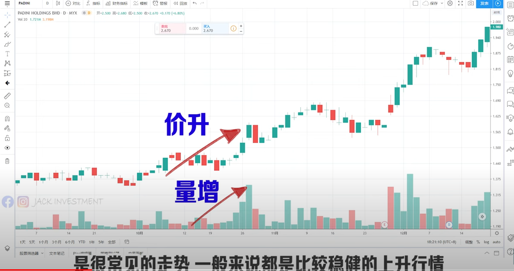
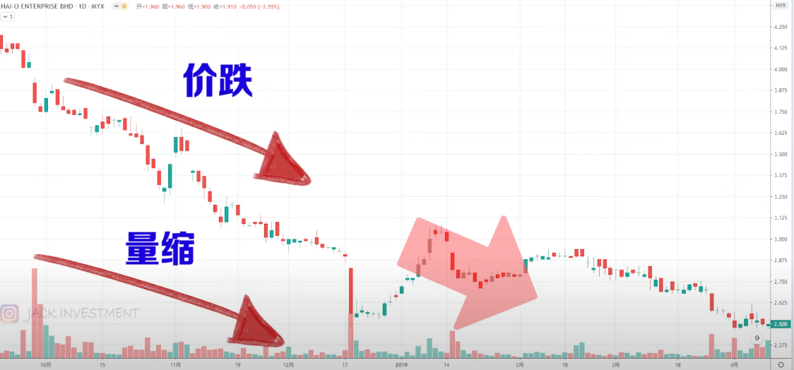
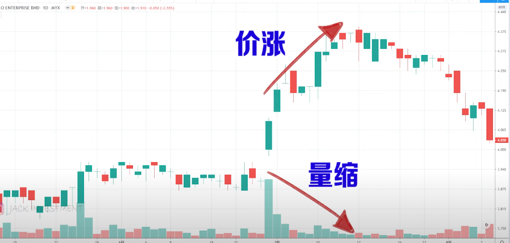
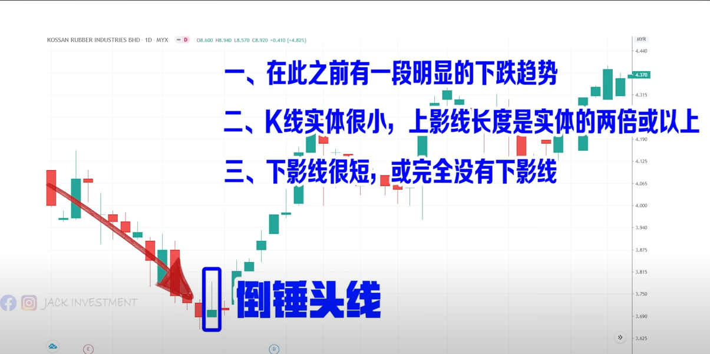
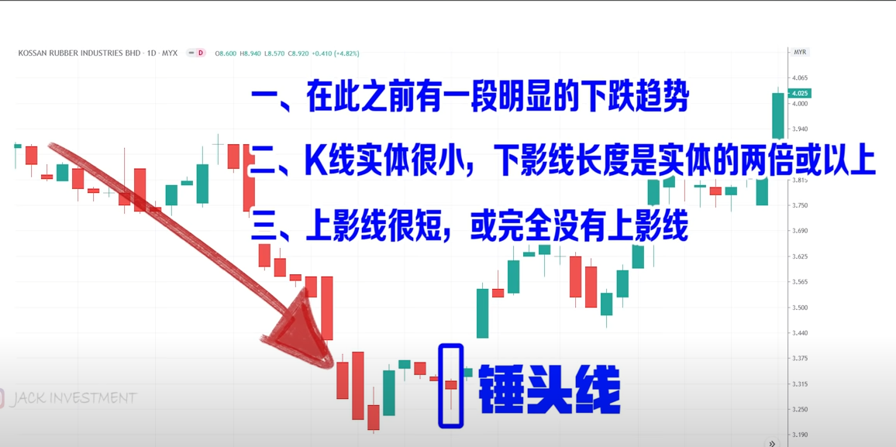

## 技术分析学习

技术分析是一种分析金融市场价格和交易量数据的方法，旨在预测市场走势并制定交易策略。以下是学习技术分析的一些建议：

1. 学习基本概念：了解技术分析的基本原理，如趋势、支撑与阻力、图表形态等。熟悉基本的图表类型，如线图、K线图、柱状图等。
2. 技术指标：学习各种技术指标的原理、计算方法和应用，如移动平均线（MA）、相对强弱指数（RSI）、布林带（Bollinger Bands）、MACD、成交量等。了解如何将这些指标用于交易决策。
3. 图表形态：研究各种图表形态，如头肩顶、双顶、双底、三角形、旗形等。了解这些形态是如何形成的，以及它们对未来价格走势的预测意义。
4. 交易策略：了解如何根据技术分析制定交易策略。学习如何结合多个技术指标和图表形态，确定入场和出场点，以及设置止损和止盈。
5. 风险管理：了解如何利用技术分析来管理风险。学习如何根据市场波动性调整仓位，以及如何利用技术指标来评估风险。
6. 学习资源：阅读技术分析相关的书籍、文章和研究报告。参加在线课程、研讨会和培训班。关注技术分析师的博客和社交媒体，了解他们的观点和策略。
7. 实践：在模拟交易平台上进行模拟交易，应用所学的技术分析知识。分析实时市场数据，练习预测价格走势。通过实践提高技术分析能力。
8. 交流与合作：加入技术分析和量化交易社区，与其他交易者和分析师互动。分享你的观点和策略，向他人学习。
9. 持续学习：金融市场和技术分析方法不断发展。保持对新的技术指标和策略的关注，不断优化自己的技能。

技术分析只是预测市场走势的一种方法，它并不能保证100%的准确性。在实际交易中，要注意风险

### 技术分析基本原理

技术分析是一种通过研究历史价格行为来预测未来价格走势的方法。它的基本原理包括以下几点：

1. 市场行为包含一切信息：技术分析的核心前提是市场价格已经反映了所有公开可用的信息，包括基本面、市场情绪和宏观经济因素。因此，分析历史价格和成交量数据足以预测未来价格走势。
2. 市场价格呈现趋势：技术分析认为市场价格在某些时期内表现出持续的上升、下降或横盘趋势。通过识别和跟随趋势，交易者可以在市场中获得利润。趋势有三种：上升趋势（价格持续上涨）、下降趋势（价格持续下跌）和横盘趋势（价格在一个范围内波动）。
3. 历史会重演：技术分析基于人类心理和行为模式在市场中的反映。人类心理在面临类似情况时往往会产生相似的反应，导致历史价格行为在未来可能重演。因此，通过研究历史价格行为，交易者可以发现市场中反复出现的模式，并据此预测未来价格走势。
4. 支撑与阻力：支撑和阻力是技术分析中两个重要概念。支撑是指价格下跌过程中可能出现的反弹点，而阻力是指价格上涨过程中可能出现的回落点。这些水平通常与过去的价格高点和低点相关。当价格接近支撑或阻力水平时，交易者可能会调整他们的买卖策略。

要成为一名成功的技术分析师，需要学习各种技术指标、图表形态和交易策略。此外，要意识到技术分析并非万能，它只是预测市场走势的一种工具。在实际交易中，结合其他分析方法（如基本面分析）以及良好的风险管理策略，将有助于提高交易成功率。

### 放量与缩量

放量与缩量是两个与交易量相关的概念。交易量是在特定时间段内的**交易次数**或**交易的资产数量**。放量与缩量通常用来**衡量市场参与度和趋势的强度。**

1. 放量（Increasing Volume）：放量是指交易量逐渐增加。在上涨或下跌趋势中，放量通常被视为**趋势持续的**信号。放量表明市场参与者对当前趋势的信心增强，买卖双方交易积极性更高。

- 上涨行情中的放量：价格上涨的同时，交易量增加，说明买方力量更强，这可能会推动价格继续上涨。
- 下跌行情中的放量：价格下跌的同时，交易量增加，说明卖方力量更强，这可能会推动价格继续下跌。

1. 缩量（Decreasing Volume）：缩量是指交易量逐渐减少。在上涨或下跌趋势中，缩量可能表示市场参与者对当前趋势的信心减弱，趋势可能面临反转或整理。

- 上涨行情中的缩量：价格上涨的同时，交易量减少，说明买方力量减弱，这可能是价格见顶的信号，或者市场进入整理阶段。
- 下跌行情中的缩量：价格下跌的同时，交易量减少，说明卖方力量减弱，这可能是价格见底的信号，或者市场进入整理阶段。

需要注意的是，放量和缩量只是市场趋势判断的一个方面。在实际操作中，建议结合其他技术分析工具（如趋势线、支撑和阻力水平、技术指标等）来评估市场趋势和交易策略。

### 如何解读股价与成交量之间的关系

新手看价 老手看量 高手看趋势，

这个理论较少用于实战中，不过新手可以打牢基础

#### 价量同步

股价和成交量走势是一致的

##### 价升量增

当股价上涨，成交量也跟着增加的时候，这种同步就叫做价升量增，一般来说是比较稳健的上升行情，说明后市高机率继续上扬

##### 价跌量缩

反之当股价下跌成交量也跟着萎缩的时候叫做价跌量缩，

一般来说如果价跌量缩出现在股票的**上升行情中**，可以视为一种回调现象, 就是有一些投资者先套利走人了，过后高机率还会再上涨

如果价跌量缩是出现再下跌行情中，一般来说买盘不强，后市仍然是偏向看跌的

#### 价量背离

就是股价和成交量的走势是不同步的

##### 价涨量缩

股价升了，成交量却减少了

这说明股价的买盘不足，上升力道不够，后市很可能反转向下

##### 价跌量增

股价跌了，成交量却增加了，后市很可能向下

### 如何用K线形态判断股价见顶或见底

#### 见顶回调讯号

1. 射击之星

   

   射击之星出现以后：代表股价较高机率进行回调，对于短期交易者来说，可以考虑减仓或者离场

   - 实体与上影线的长度差距越大，就越可能回调
   - 它先前经历的涨势越久、越大，就与可能回调
   - 当前的股价跳空高开
   - 阴烛比阳烛更有可能回调

2. 吊颈线

   

​	代表股价较高机率进行回调

#### 见低回升

1. 倒锤头线

   

   倒锤头线出现以后代表股价较高机率进行回升反弹，因此短期交易者可以考虑部署进场、捕捉涨势

2. 锤头线

   

   锤头线出现以后代表股价较高机率进行回升反弹，短期交易者可以考虑部署进场、捕捉涨势

在股市下跌趋势中，只要出现（单边的）影线比实体长很多的K线，那就是一种不错的买入讯号，需要注意：不是一出现就代表隔天马上就会回调或回升，有可能还要等一阵子才会发生，至于回调或回升的幅度会有多大，也无法从单一的K线上分析

