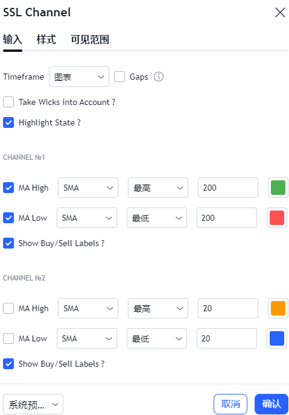
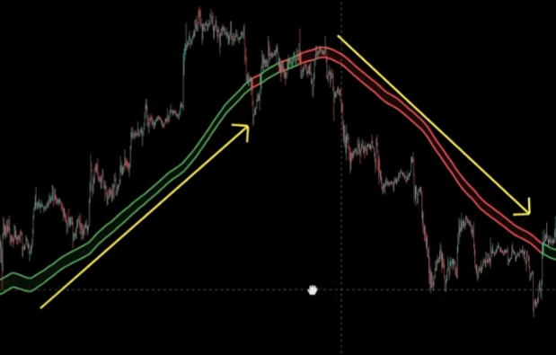
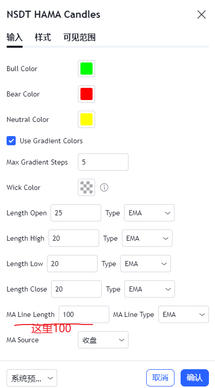
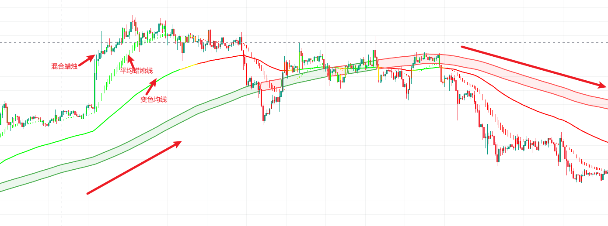
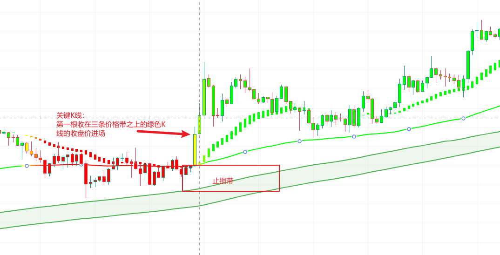
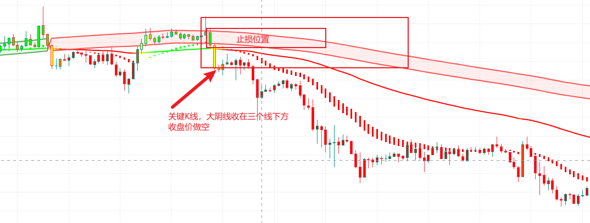

## SSL通道+平均蜡烛过滤线

抓趋势起点的交易策略

### 简介

SSL通道判断趋势的经典策略，

特点：中长期均线的特点，具备稳定性，但是同时也具备了滞后性，因此直接拿SSL通道做交易的化胜率是非常低的，而SSL + 平均蜡烛过滤线，能过滤掉很多震荡行情，盈利能力是非常强的

作用：使用SSL通道来判断市场主要的趋势

### 指标设置

该策略用到的是trandingView的两个免费指标SSL channel 和 NSDT HAMA Candles

#### 指标：SSL通道 （SSL channel）

作者：MissTricky

 链接：https://cn.tradingview.com/script/6y9SkpnV-SSL-Channel/

输入和样式设置，输入保持默认，样式去掉买卖信号

设置好后如下图

蓝色表示上升趋势，红色表示下降趋势

#### 平均蜡烛过滤线：NSDT HAMA Candles

作者：NorthStarDayTrading

参数：（MA Line Length修改为100）

链接：https://cn.tradingview.com/script/k7nrF2oI-NSDT-HAMA-Candles/

参数设置：MA Line Length 修改为100，样式中取消table选项

原理：使用了不同的移动平均线，在图表上创建了一个新的混合蜡烛，然后绘出平均蜡烛线，和一条变色均线（EMA100）用于识别市场主要的趋势

当这几条线颜色一致，都为绿色，并形成多头排列的时候就是**上升趋势行情**

当颜色一至都为红色，并且呈现空头排列的时候是**下降趋势的行情**

当颜色不一致，并且价格反复穿插的时候，位于**震荡行情**，应该过滤掉这种行情

### 交易法则

#### 【做多】： 

1. “3绿”：SSL通道为绿色上升趋势；变色均线为绿色；HAMA平均蜡烛线为绿色上升趋势； 
2. 关键K线：绿色SSL通道，绿色变色均线，绿色平均蜡烛线已经形成多头排列，或者即将形成多头排列的趋势，1个收在三条价格带之上的绿色K线。  
3. 止损：关键K线下方，或EMA100变色均线下方，或SSL通道下方。 
4. 止盈：止盈采用固定盈亏比止盈和右侧止盈结合的方式，比如可以在1:1.5的位置止盈一部分，剩余的博取更大的一部分利润，右侧止盈的方式可以设置在当价格收在平均蜡烛线/变色均线下方的信号。

#### 【做空】：

1. “3红”：SSL通道为红色下降趋势；变色均线为红色；HAMA平均蜡烛线为红色下降趋势；
2.  关键K线：红色SSL通道，红色变色均线，红色平均蜡烛线已经形成空头排列，或者即将形成空头排列的趋势，1个收在三条价格带之下的红色K线。  
3. 止损：关键K线上方，或变色均线上方，或SSL通道上方。 
4. 止盈：可以在固定1:1.5盈亏比的位置止损一部分，另外一部分拿到右侧来博取，右侧止盈可以在价格收在平均蜡烛线/变色均线上方。

（风险提醒：该文章仅限于个人技术分析学习，不构成投资建议。）