## 技术分析学习

技术分析是一种分析金融市场价格和交易量数据的方法，旨在预测市场走势并制定交易策略。以下是学习技术分析的一些建议：

1. 学习基本概念：了解技术分析的基本原理，如趋势、支撑与阻力、图表形态等。熟悉基本的图表类型，如线图、K线图、柱状图等。
2. 技术指标：学习各种技术指标的原理、计算方法和应用，如移动平均线（MA）、相对强弱指数（RSI）、布林带（Bollinger Bands）、MACD、成交量等。了解如何将这些指标用于交易决策。
3. 图表形态：研究各种图表形态，如头肩顶、双顶、双底、三角形、旗形等。了解这些形态是如何形成的，以及它们对未来价格走势的预测意义。
4. 交易策略：了解如何根据技术分析制定交易策略。学习如何结合多个技术指标和图表形态，确定入场和出场点，以及设置止损和止盈。
5. 风险管理：了解如何利用技术分析来管理风险。学习如何根据市场波动性调整仓位，以及如何利用技术指标来评估风险。
6. 学习资源：阅读技术分析相关的书籍、文章和研究报告。参加在线课程、研讨会和培训班。关注技术分析师的博客和社交媒体，了解他们的观点和策略。
7. 实践：在模拟交易平台上进行模拟交易，应用所学的技术分析知识。分析实时市场数据，练习预测价格走势。通过实践提高技术分析能力。
8. 交流与合作：加入技术分析和量化交易社区，与其他交易者和分析师互动。分享你的观点和策略，向他人学习。
9. 持续学习：金融市场和技术分析方法不断发展。保持对新的技术指标和策略的关注，不断优化自己的技能。

技术分析只是预测市场走势的一种方法，它并不能保证100%的准确性。在实际交易中，要注意风险

### 技术分析基本原理

技术分析是一种通过研究历史价格行为来预测未来价格走势的方法。它的基本原理包括以下几点：

1. 市场行为包含一切信息：技术分析的核心前提是市场价格已经反映了所有公开可用的信息，包括基本面、市场情绪和宏观经济因素。因此，分析历史价格和成交量数据足以预测未来价格走势。
2. 市场价格呈现趋势：技术分析认为市场价格在某些时期内表现出持续的上升、下降或横盘趋势。通过识别和跟随趋势，交易者可以在市场中获得利润。趋势有三种：上升趋势（价格持续上涨）、下降趋势（价格持续下跌）和横盘趋势（价格在一个范围内波动）。
3. 历史会重演：技术分析基于人类心理和行为模式在市场中的反映。人类心理在面临类似情况时往往会产生相似的反应，导致历史价格行为在未来可能重演。因此，通过研究历史价格行为，交易者可以发现市场中反复出现的模式，并据此预测未来价格走势。
4. 支撑与阻力：支撑和阻力是技术分析中两个重要概念。支撑是指价格下跌过程中可能出现的反弹点，而阻力是指价格上涨过程中可能出现的回落点。这些水平通常与过去的价格高点和低点相关。当价格接近支撑或阻力水平时，交易者可能会调整他们的买卖策略。

要成为一名成功的技术分析师，需要学习各种技术指标、图表形态和交易策略。此外，要意识到技术分析并非万能，它只是预测市场走势的一种工具。在实际交易中，结合其他分析方法（如基本面分析）以及良好的风险管理策略，将有助于提高交易成功率。

### 放量与缩量

放量与缩量是两个与交易量相关的概念。交易量是在特定时间段内的交易次数或交易的资产数量。放量与缩量通常用来衡量市场参与度和趋势的强度。

1. 放量（Increasing Volume）：放量是指交易量逐渐增加。在上涨或下跌趋势中，放量通常被视为趋势持续的信号。放量表明市场参与者对当前趋势的信心增强，买卖双方交易积极性更高。

- 上涨行情中的放量：价格上涨的同时，交易量增加，说明买方力量更强，这可能会推动价格继续上涨。
- 下跌行情中的放量：价格下跌的同时，交易量增加，说明卖方力量更强，这可能会推动价格继续下跌。

1. 缩量（Decreasing Volume）：缩量是指交易量逐渐减少。在上涨或下跌趋势中，缩量可能表示市场参与者对当前趋势的信心减弱，趋势可能面临反转或整理。

- 上涨行情中的缩量：价格上涨的同时，交易量减少，说明买方力量减弱，这可能是价格见顶的信号，或者市场进入整理阶段。
- 下跌行情中的缩量：价格下跌的同时，交易量减少，说明卖方力量减弱，这可能是价格见底的信号，或者市场进入整理阶段。

需要注意的是，放量和缩量只是市场趋势判断的一个方面。在实际操作中，建议结合其他技术分析工具（如趋势线、支撑和阻力水平、技术指标等）来评估市场趋势和交易策略。

### 如何解读股价与成交量之间的关系

新手看价 老手看量 高手看趋势，

这个理论较少用于实战中，不过新手可以打牢基础

#### 价量同步

股价和成交量走势是一致的

##### 价升量增

当股价上涨，成交量也跟着增加的时候，这种同步就叫做价升量增，一般来说是比较稳健的上升行情，说明后市高机率继续上扬

##### 价跌量缩

反之当股价下跌成交量也跟着萎缩的时候叫做价跌量缩，

一般来说如果价跌量缩出现在股票的**上升行情中**，可以视为一种回调现象, 就是有一些投资者先套利走人了，过后高机率还会再上涨

如果价跌量缩是出现再下跌行情中，一般来说买盘不强，后市仍然是偏向看跌的

#### 价量背离

就是股价和成交量的走势是不同步的

##### 价涨量缩

股价升了，成交量却减少了

这说明股价的买盘不足，上升力道不够，后市很可能反转向下

##### 价跌量增

股价跌了，成交量却增加了，后市很可能向下

### 如何用K线形态判断股价见顶或见底

#### 见顶回调讯号

1. 射击之星

   

   射击之星出现以后：代表股价较高机率进行回调，对于短期交易者来说，可以考虑减仓或者离场

   - 实体与上影线的长度差距越大，就越可能回调
   - 它先前经历的涨势越久、越大，就与可能回调
   - 当前的股价跳空高开
   - 阴烛比阳烛更有可能回调

2. 吊颈线

   

​	代表股价较高机率进行回调

#### 见低回升

1. 倒锤头线

   

   倒锤头线出现以后代表股价较高机率进行回升反弹，因此短期交易者可以考虑部署进场、捕捉涨势

2. 锤头线

   

   锤头线出现以后代表股价较高机率进行回升反弹，短期交易者可以考虑部署进场、捕捉涨势

在股市下跌趋势中，只要出现（单边的）影线比实体长很多的K线，那就是一种不错的买入讯号，需要注意：不是一出现就代表隔天马上就会回调或回升，有可能还要等一阵子才会发生，至于回调或回升的幅度会有多大，也无法从单一的K线上分析

### 移动平均线

移动平均线（Moving Average，简称MA）是一种技术分析工具，用于平滑价格数据，以便更好地识别和跟踪市场趋势。移动平均线通过计算一定时间周期内价格的平均值，并随着时间推移向前移动，从而产生一条平滑的曲线。移动平均线有多种类型，包括简单移动平均线（SMA）、指数移动平均线（EMA）和加权移动平均线（WMA）等。

1. 简单移动平均线（SMA）：简单移动平均线是最常用的移动平均线类型。它通过计算一定时间周期内收盘价的算术平均值来绘制。例如，10日SMA是将过去10个交易日的收盘价相加，然后除以10。
2. **指数移动平均线（EMA）**：指数移动平均线是另一种常见的移动平均线类型。EMA对**近期价格数据赋予更大的权重**，因此对价格变动更敏感。EMA的计算涉及更复杂的公式，以便在平滑价格数据的**同时更快地反应价格变动**。
3. 加权移动平均线（WMA）：加权移动平均线类似于EMA，也是对近期价格数据赋予更大的权重。不同之处在于WMA采用线性加权方法，而EMA采用指数加权方法。

**移动平均线在技术分析中具有多种应用**，包括：

1. 确定趋势：当价格在移动平均线之上时，通常被认为是上升趋势；当价格在移动平均线之下时，通常被认为是下降趋势。

2. **支撑与阻力**：移动平均线可以作为动态支撑和阻力水平，个人比较喜欢用EMA来判断支撑和阻力。

   比如相对有效的**中短期可使用EMA30**：在上升趋势中，移动平均线可能会成为价格的支撑， 当跌破支撑线代表股价短期转弱，应该减仓或离场；

   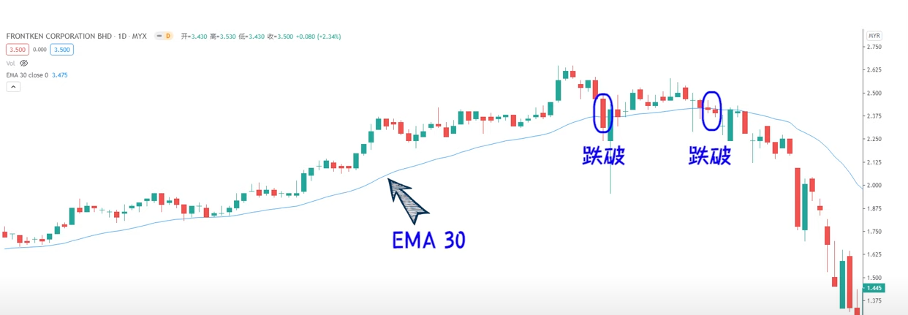

   在下降趋势中，移动平均线可能会成为价格的阻力，一旦股价向上突破，代表股价短期转强

   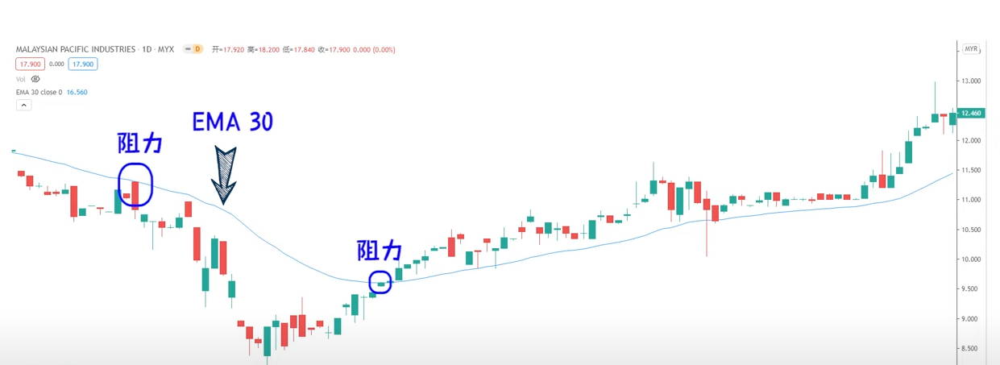

   画支撑阻力线时可根据自己的投资策略来绘，如果长期投资，可在周线图上画，如果中短线再日线图上画线，短线可在4小时或更短周期上划线

3. **交叉信号**：当两条不同周期的移动平均线交叉时，可能产生买入或卖出信号。例如，当短期移动平均线上穿长期移动平均线时，可能产生**买入信号**；当短期移动平均线下穿长期移动平均线时，可能产生**卖出信号**。中长期均线组合：MA550, MA200搭配， 短期均线组合：MA10，MA30搭配

需要注意的是，移动平均线是滞后指标，不能预测未来价格变动。在实际操作中，建议结合其他技术分析工具来评估市场趋势和交易策略。以下是一些建议您结合使用的技术分析工具：

1. 趋势线：趋势线可以帮助您确定价格趋势的方向和强度。通过连接价格图上的低点（上升趋势）或高点（下降趋势），您可以绘制趋势线。趋势线可作为动态支撑或阻力水平，当价格突破趋势线时，可能产生买入或卖出信号。
2. 技术指标：技术指标是基于价格和交易量数据的数学计算，可用于衡量市场趋势、动量、波动性和相对强度等因素。一些常用的技术指标包括相对强度指数（RSI）、布林带（Bollinger Bands）、平滑异同移动平均线（MACD）和随机指标（Stochastic Oscillator）等。结合这些指标，您可以更准确地评估市场状态并制定相应的交易策略。
3. 图形和图案识别：图形和图案识别是技术分析的另一个重要组成部分。这包括头肩顶、头肩底、三角形、旗形、楔形等图案。这些图案可以帮助您预测市场可能的走势，从而为您提供交易机会。
4. 价量分析：价量分析是研究价格和交易量之间关系的一种方法。通过观察价格变动与交易量的关系，您可以判断市场趋势的强度和可能的反转点。例如，放量上涨可能表明趋势较强，而缩量上涨可能表明趋势可能反转。

在实际操作中，应结合多种技术分析工具来评估市场趋势和制定交易策略

### RSI 相对强弱指数：

相对强弱指数（Relative Strength Index，简称RSI）是一种常用的技术分析指标，由技术分析师J. Welles Wilder在1978年首次提出。RSI用于衡量资产价格变动的速度和幅度，以判断市场的超买和超卖状况以及潜在的趋势反转点。

RSI的计算方法如下：

1. 计算连续上涨日和下跌日的平均收益率。通常使用14个交易日作为周期。计算还是取决于投资周期，投资周期越短，指标变得越敏感起伏越大，杂讯越多。新手还是14天更好
2. 将平均上涨日收益率除以平均下跌日收益率，得到相对强度（RS）。
3. 使用以下公式计算RSI：RSI = 100 - [100 / (1 + RS)]

RSI的取值范围在0到100之间。通常情况下，RSI值大于70被认为是超买区，表明资产可能被过度买入，价格可能会出现回调；RSI值小于30被认为是超卖区，表明资产可能被过度卖出，价格可能会出现反弹。

RSI的一些常见应用包括：

1. 趋势反转信号：RSI进入超买或超卖区域可能预示趋势反转。**当RSI从超买区回落时，可以考虑卖出或开空仓位；当RSI从超卖区反弹时，可以考虑买入或开多仓位。**
2. 背离信号：当价格创新高（新低），但RSI未能同步创新高（新低），可能产生背离信号。这意味着当前趋势可能减弱，市场可能出现反转。例如，当价格创新高，但RSI未能创新高，被称为“顶背离”，可能预示价格下跌；当价格创新低，但RSI未能创新低，被称为“底背离”，可能预示价格上涨。
3. RSI支撑和阻力：RSI也可以显示支撑和阻力水平。在一定时间范围内，RSI可能会在特定的水平上反复反弹或回落。当RSI突破这些水平时，可能产生买入或卖出信号。

需要注意的是，RSI作为一个技术分析指标，可能会产生误导性信号。在实际操作中，建议将RSI与其他技术分析工具（如趋势线、移动平均线、图形和图案识别等）结合使用，以便更准确地评估市场趋势和制定交易策略。同时，考虑风险管理和资金管理，确保您的交易风险可控。

在实际操作中，您可以尝试结合以下技术分析工具：

1. 平滑异同移动平均线（MACD）：MACD是一种动量指标，用于衡量资产短期和长期趋势之间的关系。MACD由两条线组成：MACD线（短期EMA与长期EMA之差）和信号线（MACD线的EMA）。当MACD线上穿信号线时，可能产生买入信号；当MACD线下穿信号线时，可能产生卖出信号。
2. 布林带（Bollinger Bands）：布林带是一种波动性指标，由中心线（通常是价格的简单移动平均线）和两条标准差线组成。当价格触及或突破布林带上轨时，可能产生卖出信号；当价格触及或突破布林带下轨时，可能产生买入信号。布林带的宽度可以反映市场波动性，宽度增加表示波动性增加，宽度减小表示波动性减小。
3. 随机指标（Stochastic Oscillator）：随机指标是一种动量指标，用于判断价格相对于其最近价格范围的位置。随机指标由两条线组成：%K线和%D线。当%K线上穿%D线且在超卖区时，可能产生买入信号；当%K线下穿%D线且在超买区时，可能产生卖出信号。
4. 成交量指标：成交量指标可以帮助您分析市场参与度和趋势的强度。常见的成交量指标包括成交量加权平均价格（VWAP）、成交量柱状图、强势指数（On Balance Volume, OBV）等。结合成交量指标，您可以判断市场的买卖力量和可能的趋势反转点。

在实际操作中，建议您根据自己的交易风格和市场环境选择合适的技术分析工具。同时，不要忽视基本面分析和市场情绪等其他因素，它们也会影响资产价格的走势。请务必保持谨慎和适应市场变化，确保您的交易策略能够持续优化和改进。

#### 顶背离：

当股价一次次走出新高，而RSI反而走出一次比一次低的趋势，这就是顶背离，意味着股票大概率走向顶端，可以考虑减持或全数落袋为安

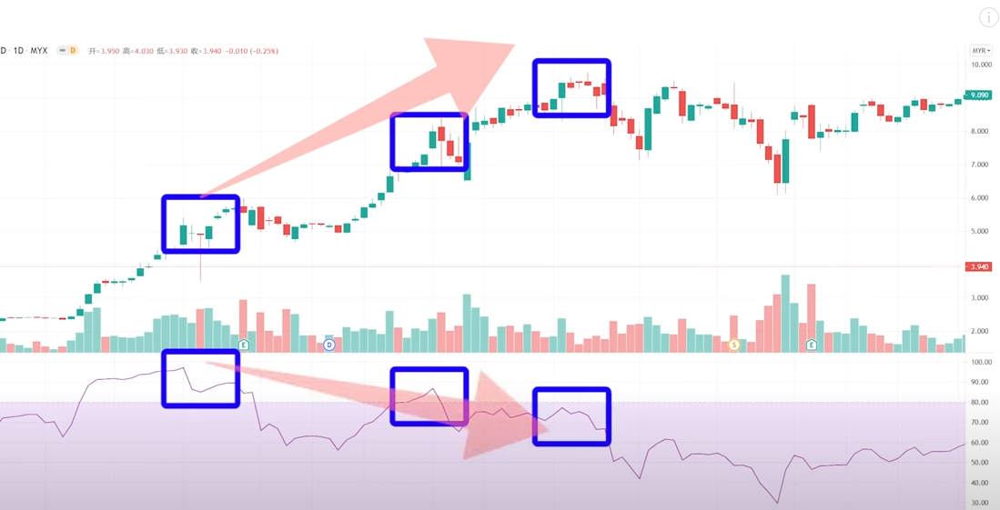

#### 底背离：

当股价一此次走出新低，而RSI在创出近期低点后，反而走出一次比一次高的趋势，这种想象大概率走到底部，可以适当抄底，或者逢低建仓

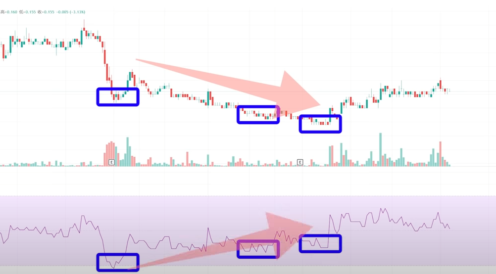

### 布林通道

布林通道（Bollinger Bands）是由约翰·布林格（John Bollinger）在20世纪80年代提出的一种技术分析工具。布林通道通过计算价格的移动平均线（通常为简单移动平均线，SMA）和价格的标准差来显示资产价格的波动性和可能的趋势反转点。

布林通道由三条线组成：

1. 中心线（Middle Band）：通常为价格的n周期简单移动平均线（SMA）。n通常取值为20，也就是近20天买入者的平均成本，但可以根据需要调整。
2. 上轨（Upper Band）：中心线加上k倍的标准差。k通常取值为2，表示上轨距离中心线2个标准差。
3. 下轨（Lower Band）：中心线减去k倍的标准差。k通常取值为2，表示下轨距离中心线2个标准差。

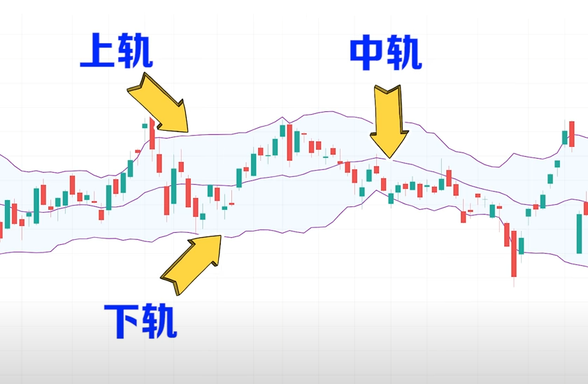

在这套指标底下包宁杰提出一只股票95%的股价波动会落于这个通道内，也就是和说K线冲出上下轨之外的机率个别只有2.3%左右

通常可以认为布林通道的上轨为阻力线，当股价触碰到上轨，很有可能见顶回落，所以应该趁高套利

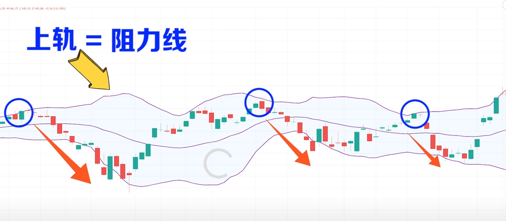

当股价触碰到下轨时，很有可能反弹

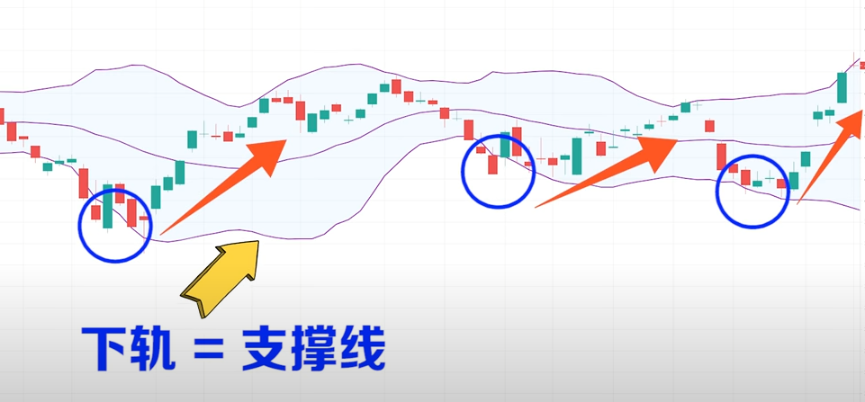

还有一种是理论说的是布林通道由窄变宽形成类似喇叭口的形状，这意味着有新行情即将启动，投资者可以随时准备做多或做空，

如果股价处于中轨这百年成本线之上代表近20天的买入者多数是账面盈利的，少有止损的需求，股价短期的走势偏强

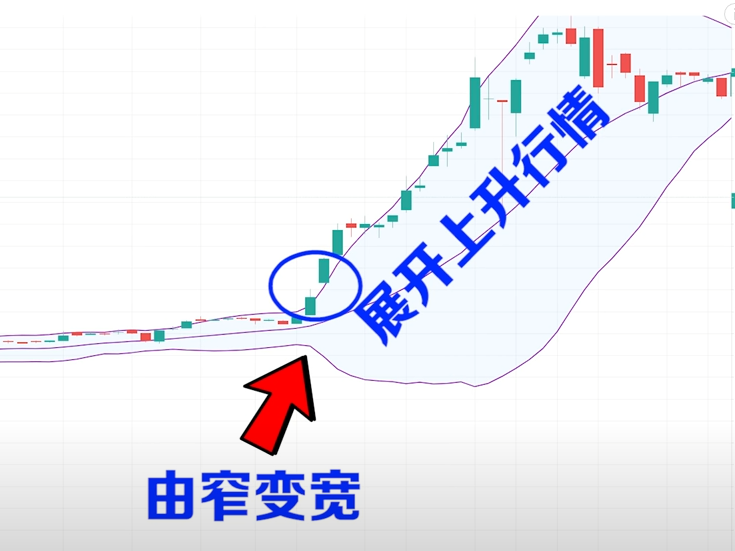

反之如果股价处于成本线之下，代表大多数人是亏损着的，很有可能触发他们止损，股价短期的走势就偏弱

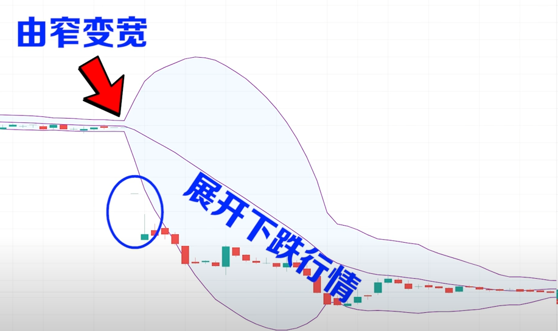

布林通道的主要应用包括：

1. 趋势判断：当价格在上轨和中心线之间波动时，市场可能处于上升趋势；当价格在下轨和中心线之间波动时，市场可能处于下降趋势。
2. 趋势反转信号：当价格触及或突破上轨时，可能预示价格的反转向下；当价格触及或突破下轨时，可能预示价格的反转向上。然而，这并非绝对，布林通道只是提供了一种参考，并不能保证100%的准确性。
3. 波动性指标：布林通道的宽度（上轨与下轨之间的距离）可以反映市场波动性。通道宽度变大表示波动性增加，通道宽度变小表示波动性减小。在通道变窄后，市场可能会出现较大的波动（突破），称为“布林通道收缩”。
4. 指导止损和止盈：布林通道的上轨和下轨可以作为参考，设置止损和止盈位置。例如，可以在价格突破上轨时设置止损在中心线附近，或在价格突破下轨时设置止盈在中心线附近。

需要注意的是，布林通道作为一个技术分析工具，并不能保证100%的准确性。在实际操作中，建议将布林通道与其他技术分析工具（如移动平均线、RSI、MACD等）结合使用，以便更准确地评估市场趋势和制定交易策略

## 交易计划

盈亏比：盈利和亏损的比例，盈亏比是交易者必须具备的概念，不懂盈亏比我们就注定亏多过赚

可以用tradview左侧工具栏中的多头工具设置，投资价和止盈止损

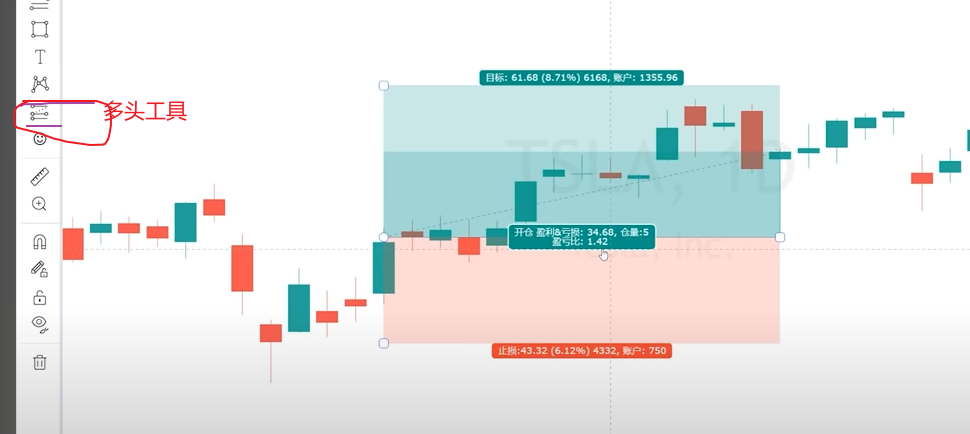

### 技术指标之王MACD

MACD（Moving Average Convergence Divergence，平滑异同移动平均线）是一种流行的技术分析指标，由Gerald Appel于20世纪70年代提出。MACD通过计算价格的短期指数移动平均线（EMA）与长期指数移动平均线之间的差异来分析资产价格的趋势和动量。

MACD的计算方法如下：

1. 快线（MACD线）：短期EMA与长期EMA之差，通常取12日EMA和26日EMA之差。
2. 慢线（信号线）：MACD线的m日指数移动平均线，通常取9日EMA。
3. 柱状图（Histogram）：MACD线与信号线之差。

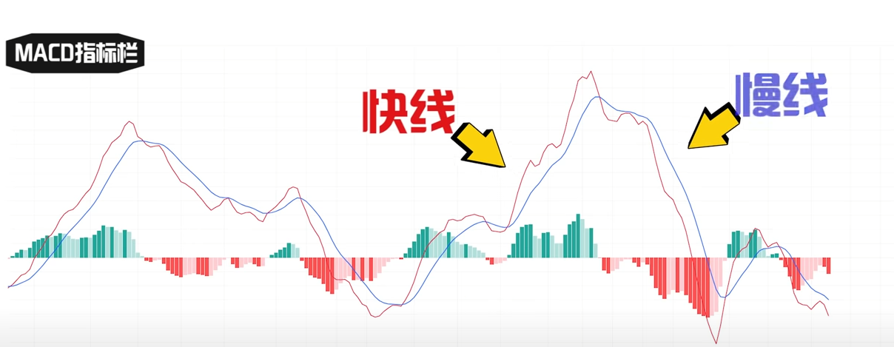

MACD的主要应用包括：

1. 趋势判断：当两条线都位于轴线上方时，代表处于多头趋势，偏向看涨，如果两条线都在零轴之下，代表处于空头趋势，偏向看跌。 当MACD线高于信号线时，市场可能处于上升趋势；当MACD线低于信号线时，市场可能处于下降趋势。

   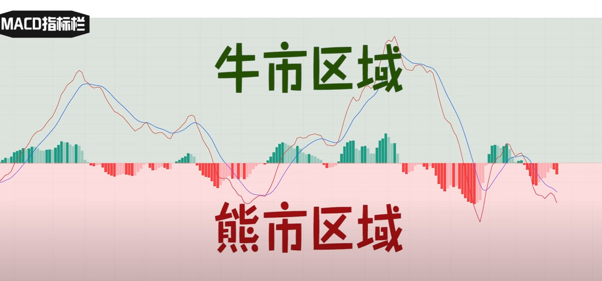

2. 交叉信号：当MACD线上穿信号线时，可能产生买入信号；当MACD线下穿信号线时，可能产生卖出信号。这种交叉信号也称为“金叉”（买入信号）和“死叉”（卖出信号）。

   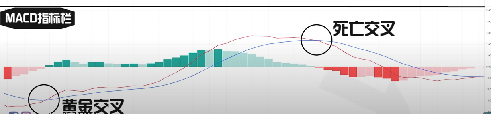

3. 背离信号：当价格创新高（新低）而MACD没有创新高（新低）时，可能产生顶背离（底背离）信号。顶背离可能预示价格的下跌，而底背离可能预示价格的上涨。然而，背离信号并非绝对，需要与其他技术分析工具结合使用以提高准确性。

   底背离

   当股价逐步下跌MACD的走势却没有同步跌出**新低点**，反而逐步上扬时，代表着股价背后的下跌力道越来越弱，股价越来越低，卖盘却越来越弱，意味着股价大概率走到了底部，行情很有可能出现反转，所以伺机买入

   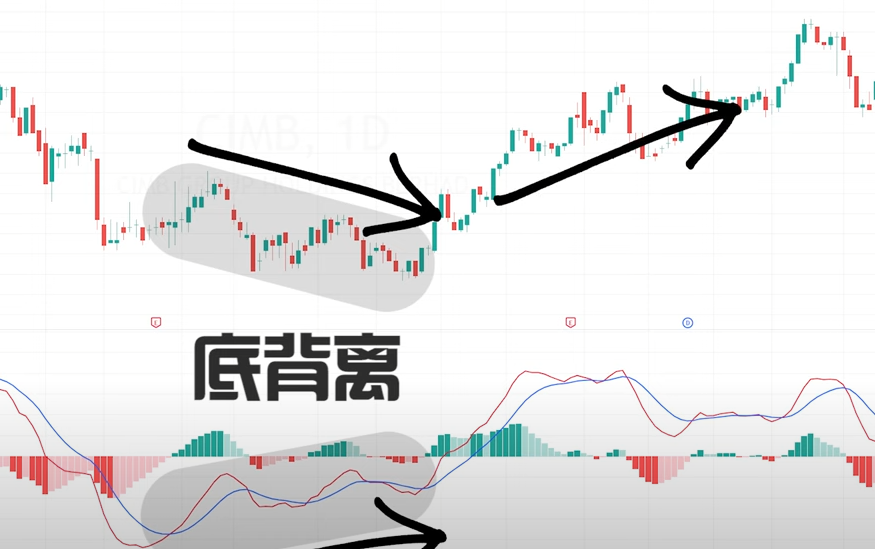

   顶背离

   当股价走出上升趋势、不断创出新高点时MACD的走势却没有同步创**新高**，反而走出下跌趋势，这种状况就是所谓的顶背离，意味着新买盘已经支撑不住高股价，行情很可能出现反转，是卖出信号

   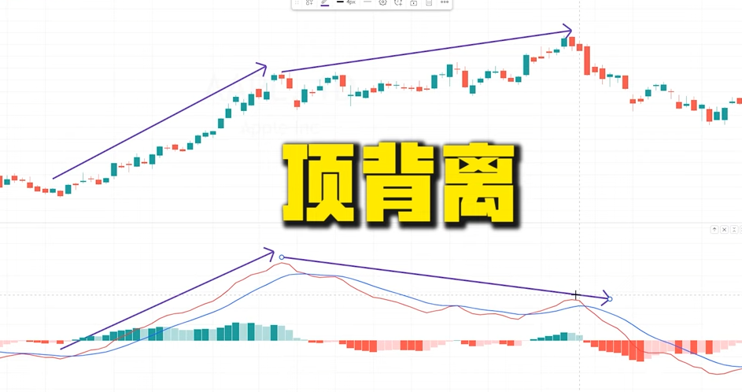

   双重顶背离

   底部柱状图也和MACD走出一样呈现下行趋势，理论上来说这是更加弱势的看空形态，下跌的概率更高

   

4. 柱状图（Histogram）：当柱状图高于0时，表示MACD线高于信号线，可能预示市场上涨；当柱状图低于0时，表示MACD线低于信号线，可能预示市场下跌。柱状图的变化可以帮助分析市场动量的增强或减弱，柱子由红转绿，代表趋势转强适合做多，绿转红适合做空

需要注意的是，MACD作为一个技术分析指标，并不能保证100%的准确性。在实际操作中，建议将MACD与其他技术分析工具（如布林带、RSI、支撑和阻力等）结合使用，以便更准确地评估市场趋势和制定交易策略。同时，始终关注风险管理和资金管理，以确保交易风险可控。

#### 斐波拉契技术

斐波那契工具是一种常用的技术分析方法，基于意大利数学家莱昂纳多·斐波那契（Leonardo Fibonacci）发现的斐波那契数列。在技术分析中，斐波那契工具主要应用于预测价格的支撑和阻力位置以及趋势反转的可能性。

斐波那契数列的特点是每个数字都是前两个数字的和，例如：1, 1, 2, 3, 5, 8, 13, 21...。在斐波那契数列中，相邻数字的比例趋近于0.618，称为黄金分割比例。此外，还有其他一些比例，如0.382（1减去黄金分割比例）和0.5，也常用于技术分析。

常用的斐波那契工具包括：

1. 斐波那契回撤线：在价格的上升或下降趋势中，价格往往会回撤一部分。斐波那契回撤线通过将价格的涨跌幅度乘以斐波那契比例（通常为0.382、0.5和0.618），然后从最高点或最低点绘制水平线，以预测可能的支撑和阻力位置。
2. 斐波那契扩展线：用于预测趋势延续后可能到达的价格位置。通常，将价格的涨跌幅度乘以斐波那契比例（如1.618），然后从最高点或最低点绘制水平线。
3. 斐波那契时间区域：用于预测趋势反转的可能时间。通过将斐波那契数列应用于时间轴上，可以找出趋势反转的可能时间点。
4. 斐波那契扇形线：通过将斐波那契比例应用于价格和时间的角度，可以绘制出一组从枢轴点（如最高点或最低点）开始的射线。这些射线可以帮助分析趋势的强度和可能的支撑和阻力位置。

