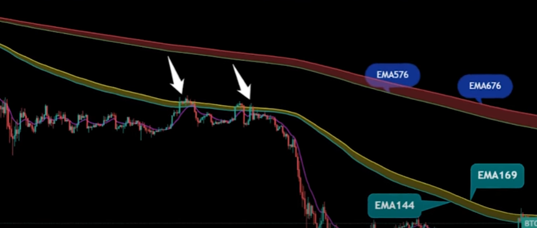

## 维加斯（Vegas）隧道交易法

主要作用：**中长期走势（趋势）**

使用周期：4小时 

维加斯隧道交易法是对**市场趋势**和**价格走势**分析的一种指标工具，它由两组指数型移动平均线EMA组成

1. 第一组：144EMA和169EMA
2. 第二组：567EMA和676EMA

两组指数型移动平均线在价格走势过程中各自会形成一个隧道，这个隧道就叫维加斯隧道。维加斯隧道对价格**中长期走势**有重要的指导意义。

### 维加斯隧道交易法的特点

维加斯隧道在市场价格走势过程中会形成隧道的**金叉**，**死叉**；隧道的**多头排列**；隧道的**空头排列**等形态。隧道的不同形态对价格走势判断有不同的意义。

当隧道金叉同时向上运行，并且隧道保持一定斜率和宽度，则表示目前这段趋势已经确立多头并相对稳定发展，**逢低做多**是主要策略。

当隧道死叉同时向下运行，并且隧道保持一定斜率和宽度，则表示目前这段趋势已经确立空头并相对稳定发展，**逢高做空**是主要策略。

当隧道走平行运行并且收窄或者相互缠绕，则表示目前市场价格处于盘整震荡之中，耐心**等待**趋势走出来再进场交易。

### 维加斯隧道交易法对趋势的判断原则

判断趋势的3个原则：

1. **EMA144**与**EMA169**这两条指数移动平均线，为**中短期趋势的分水岭**，当价格落在两条EMA上方时，趋势处于多头行情，再下方则处于空头行情

2. **EMA12**是**过滤线**，用来过滤行情是否有假突破现象。

   - 价格和EMA12必须同时**向上**穿越EMA144、EMA169，才能考虑**做多**；
   - 价格和EMA12必须同时向下穿越EMA144、EMA168，才能考虑**做空**；

   假信号

   

3. **EMA576**、**EMA676**两条均线判断**长期趋势**。无论如何都要**顺着大趋势操作**，只要与EMA576、EMA676两条方向不一致，则放弃操作，并且等待最佳出手点的到来

维加斯隧道主要用于判断趋势的指标，应该结合其他指标进行操作

**该文章只用于个人学习记录，不构成投资建议，请勿使用该指标进行相关投资**